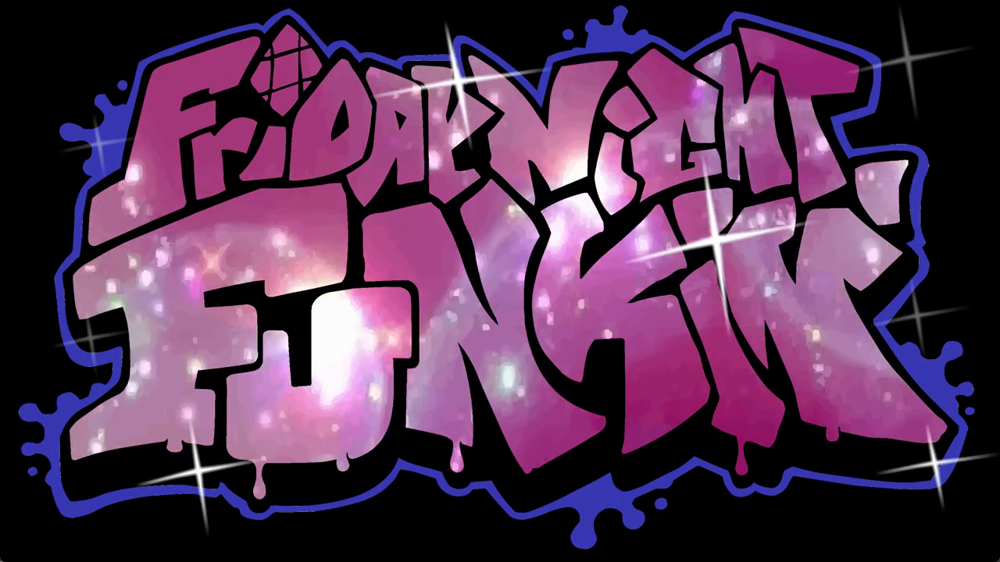
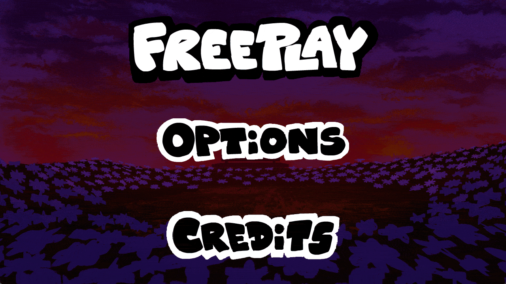

Hey guys! Malloy here.

This is the first WeekBox Mod of the Week post, and I wanted to start with a mod that shows exactly why I made this series.

This week’s pick is **[Anniversary Oneshot](https://gamebanana.com/mods/698523)**, made by **[Benniebo0](https://x.com/benniebo0)**.

Anniversary Oneshot was made in about a month as an anniversary gift. The reason behind it, along with the amazing art and atmosphere, immediately made it stand out to me.

The first thing you see when opening the mod is an intro that reminded me a little of Deltarune. The Friday Night Funkin’ logo slowly appears while a voice sings in the background, which especially reminded me of the Deltarune Chapter 5 intro. The custom logo animation looks amazing too.

The main menu uses the same stage seen throughout the song. When you select Freeplay, instead of fading to black, the camera smoothly zooms directly into the stage and the song begins right at the end of the transition.

It is so smooth. I really like small details like this because they make the mod feel much more unique.

When the song begins, the stage is darker and the sun is slightly visible. As the song continues, the sun slowly rises and lights up the whole stage. It is genuinely beautiful.

The mod takes place in a huge field of flowers under a really pretty sunset. The colors feels calm and personal, and it is different from the usual stages seen in many other mods.

Around the middle of the song, a wind effect moves through the scene along with some really cool artwork and a slight modchart. and It fits naturally with the song and the atmosphere.

The song then fades out into the credits, which includes a really sweet message.

What I like most about Anniversary Oneshot is that it doesn't try to be bigger than it needs to be.

It is one song, but everything from the intro to the credits works together and leaves an pretty impression of what it means.

For our first week, the pick is **[Anniversary Oneshot](https://gamebanana.com/mods/698523)**.

Check it out on GameBanana and give it a play. If you enjoy it, leave the creators a like, a thank, or a comment. Supporting smaller projects helps their work reach more people and shows the creators that their work is appreciated.

Congratulations to everyone who worked on Anniversary Oneshot.

You are officially WeekBox’s first **Mod of the Week**.

**Malloy**\
*WeekBox Project Lead*
