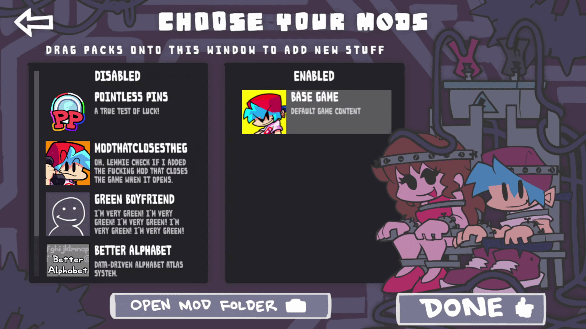
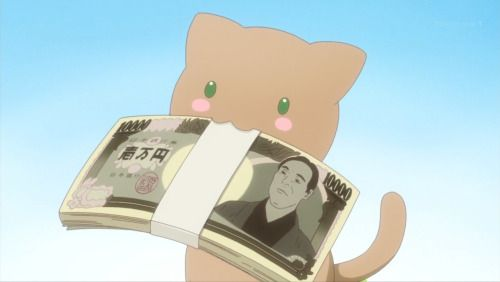

What's up everyone! I'm Britex (Lead Owner). It's my turn to write today's article to tell you a bit about what's going on behind the scenes. Along with Malloy and the whole team, we have several things we want to talk to you about.

### The deal with the base FNF game

First, let's talk about what's happening with the Friday Night Funkin' base game. As you've probably seen by now, they announced that they're adding an internal mod manager and that you'll be able to install mods straight from Game Banana.

To be honest, this is a challenge for us. It's a great step forward for the community, but it will most likely cause WeekBox to lose a number of users, since our main idea was always exactly that: making mod installation and management quick and easy.

In fact, it's something we saw coming and we talked about it with other developers. I'll leave you a screenshot of what Kade Dev told us about this, acknowledging the work we've put into the launcher for the community.

Because of this, we're asking for a huge favor: please help us share WeekBox. Despite the changes in the official game, we're going to keep supporting the other engines. We were seriously thinking about removing V-SLICE (the base game) once they have official support for installing mods, because it might not make much sense to have an engine that already does that on its own. But I think in the end we'll leave it in; that way, those who use WeekBox can have all the community engines and the base game in a single place and manage everything just like always.

### We have a Twitter account now

To keep you more informed, we've officially opened the WeekBox Twitter account!

You can go follow us by clicking here: [Twitter Link](https://x.com/WeekBoxTeam)

We'll be posting updates on how development is going, what we're up to, and so you can see that we never stop working. Basically, we are our own bosses, but we look like our own slaves working on this.

### The new team members

The community and the team keep growing. I want to take this chance to introduce you to the new people who joined the team and are helping us make WeekBox better:

* **Translation Team:** So WeekBox can reach more places, Gunibert (German), Gobbles and KaruSoda (Portuguese), Sarah! (Italian), and Xelt (Latin American Spanish) have joined us.
* **Beta Tester:** Let's welcome Maskiu, who will be testing the launcher on Windows to help us hunt down bugs before we release updates.
* **Development:** Flain joins us, our new programmer who is here to lend a hand and improve things.

### What's coming for the 2.x.x versions

We've been working a ton to prepare what will be the new era of WeekBox. From versions 2.x.x onwards, you're going to see some pretty big changes:

1. **Interface redesign and mobile:** We are adapting and redesigning the whole system so we can start bringing WeekBox to mobile phones.
2. **PC improvements:** The redesign will also make using the launcher on your computer feel much smoother, more comfortable, and pleasing to the eye.
3. **Bug fixes:** We're going to make several internal adjustments to polish details and improve the launcher's performance.

### Found a bug?

You know how it is with new things, little issues always pop up. If you notice anything failing while using the launcher, let us know in the Discord server. You can join from this link: [Discord Link](https://discord.gg/xQTtYF2Cfn). Your feedback helps us a lot to keep fixing things.

### Donations and the future of WeekBox

Lastly, I want to remind you that WeekBox is a passion project we do for the love of the craft and the community. We want to help out with what we can and what we have; we aren't looking to get rich off this.

However, keeping the project alive has its operating costs. That's why, in the future, we're going to add a donation button. It will be 100% voluntary, just a space for those who like what we do and want to give us a hand financially to pay for things like servers or tools. If you want to use your money to support us, we'll be incredibly grateful; if not, no worries at all, you'll still be able to use WeekBox exactly the same as always.

Thanks everyone for the support, for sharing the launcher, and for being part of WeekBox! Stay tuned for the upcoming updates.

— **Britex (Lead Owner)**
