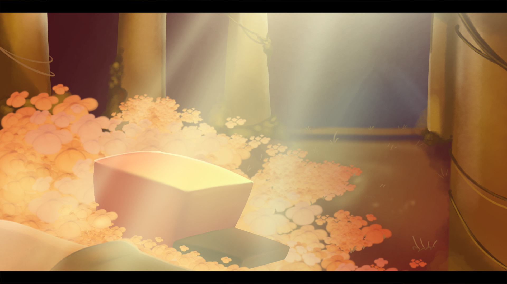

Something doesn't add up... What are you doing here?

Right in the middle of 2020, the story of Mount Ebott completely changes when two very different humans accidentally fall in. Forget the traditional pacifist or genocide routes: this time it's Bfriend and Gfriend who venture into the depths of the Underground. Their mission is to win over the monsters through rhythm, survive the classic encounters, and find a way to break the barrier to free everyone. Do you have the determination to achieve it?

Sadly the mod has been cancelled due to MASSIVE leaks, please go show them some love cause the mod seems super cool ! 

Btw, we will host a poll at WeekBox so you can choose and vote for your favorite mod of the week !

\- LéaNimatics
