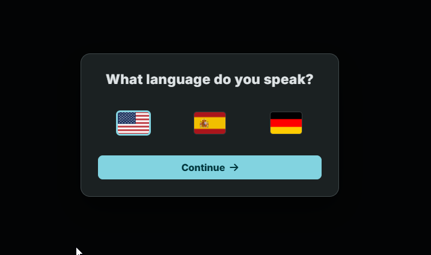
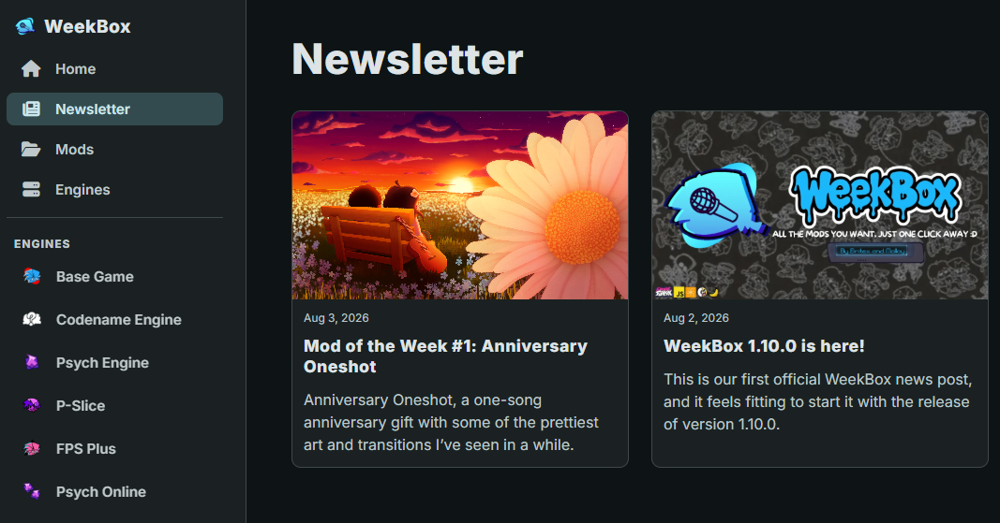
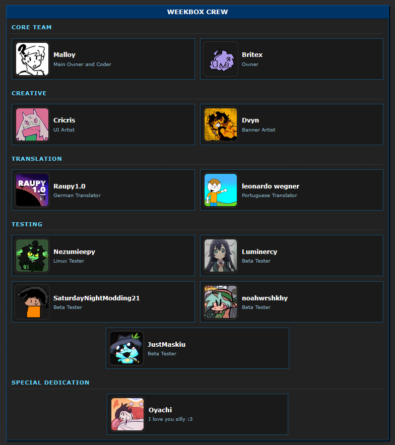
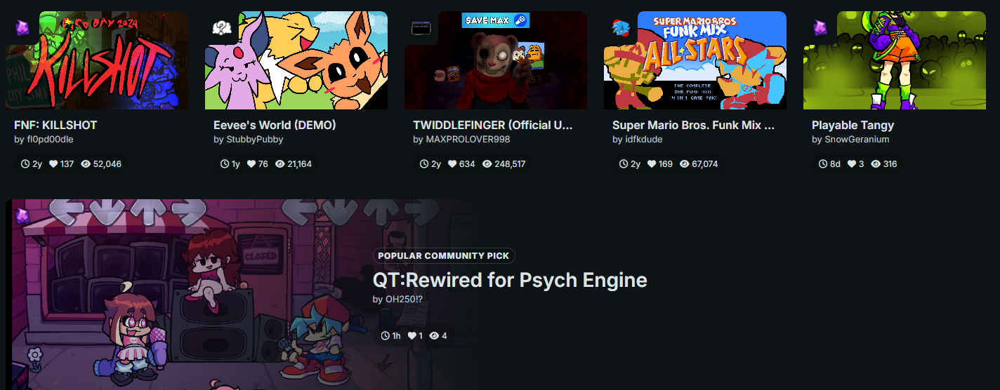

Hey guys! Malloy here.

WeekBox 2.0.0 is now available, and this is easily one of the biggest updates we have released so far.

This update adds a lot of new things, while also fixing old problems, cleaning up the app, and making WeekBox easier to use for more people.

## News inside WeekBox

WeekBox now has its own News page.

This is where we will post update announcements, Mod of the Week articles, project news, and anything else we want to share with the community.

News posts now have their own article pages too. This post is available directly inside WeekBox, which still feels pretty cool to say.

## Better discovery cards

We have also improved the discovery cards, their animations, colors, and how featured mods rotate.

## More languages

WeekBox now officially supports English, German, and Spanish.

German and Spanish are new in this release.

A language picker will appear the first time you open the app, with flags to make each option easier to recognize. You can still change your language later from Settings.

We also improved a lot of the existing English text so the app feels more consistent.

## The WeekBox Credits page

We added a public Credits page showing the people who have helped build WeekBox.

A lot of people have contributed through development, design, testing, translations, feedback, and other work, so we wanted a proper place to credit everyone. ❤️

[View the WeekBox Credits page](https://fnfweekbox.vercel.app/credits)

## Thank you

WeekBox 2.0.0 took a lot of work.

Thank you to everyone who has downloaded the app, reported errors, tested updates, suggested features, helped with translations, created artwork, or supported the project in any way.

More news, translations, fixes, and features are coming.

**WeekBox 2.0.0 is available now.**

**Malloy**  
*WeekBox Project Lead*
